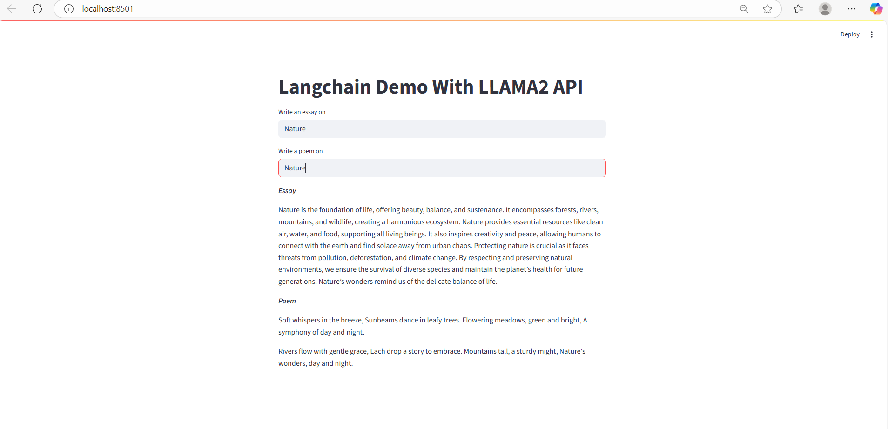

# 📝 LangChain & LangServe Project: Essay and Poem Generator

Welcome to the **Essay and Poem Generator**, a project showcasing the power of **LangChain** and **LangServe** to create a FastAPI-based server that generates essays and poems using large language models (LLMs). This README explains the project, guides you on how to use it, and suggests ways to customize it. Let's dive in! 🚀

---

## 🌟 Project Overview

This project combines **LangChain** for building LLM workflows, **LangServe** for deploying them as APIs, and a **Streamlit** client for user interaction. It supports two main functionalities:
- **Essay Generation**: Uses AzureChatOpenAI to generate 100-word essays on user-provided topics.
- **Poem Generation**: Uses the Ollama model (Gemma) to create 100-word poems on user-specified topics.

The server is built with **FastAPI**, and the client is a simple Streamlit app for interacting with the API. The project demonstrates how to structure LLM-based APIs with reusable prompts and structured inputs.

---

## 🛠️ Project Structure

- **`app.py`**: The FastAPI server that hosts LangServe endpoints for essay and poem generation.
- **`client.py`**: A Streamlit client for users to input topics and view generated essays and poems.
- **`.env`**: Stores environment variables for Azure OpenAI credentials (not included in the repository).

---

## 🎯 How to Use the Project

### Prerequisites
- Python 3.8+
- Install dependencies: `pip install fastapi langserve langchain langchain-openai langchain-community pydantic uvicorn streamlit python-dotenv requests`
- Install Ollama and ensure the `gemma` model is available (see [Ollama documentation](https://ollama.ai/)).
- Azure OpenAI account with API key, endpoint, and deployment name.

### Setup Instructions
1. **Clone the Repository**:
   ```bash
   git clone <repository-url>
   cd <repository-folder>
   ```

2. **Set Up Environment Variables**:
   - Create a `.env` file in the project root.
   - Add the following:
     ```
     AZURE_OPENAI_API_KEY=your_azure_api_key
     AZURE_OPENAI_ENDPOINT=your_azure_endpoint
     AZURE_OPENAI_DEPLOYMENT=your_deployment_name
     ```

3. **Run the FastAPI Server**:
   ```bash
   python app.py
   ```
   The server will run on `http://localhost:8000`. Access the API docs at `http://localhost:8000/docs`.

4. **Run the Streamlit Client**:
   ```bash
   streamlit run client.py
   ```
   Open the Streamlit app in your browser (typically `http://localhost:8501`).

5. **Interact with the App**:
   - Enter a topic in the "Write an essay on" field to generate an essay.
   - Enter a topic in the "Write a poem on" field to generate a poem.
   - View the generated content displayed on the Streamlit interface.

---
_Landing Page_


## 🚀 Customizing the Project

Here are some ways you can extend or modify the project:

### 1. Add New Endpoints
- **Add a New Route**: In `app.py`, create a new `ChatPromptTemplate` for a different task (e.g., story generation) and add a new route using `add_routes`. Example:
  ```python
  prompt3 = ChatPromptTemplate.from_template("Write a 100-word story about {topic}")
  add_routes(app, (prompt3 | model).with_types(input_type=PromptRequest), path="/story")
  ```
- Update `client.py` to include a new input field and API call for the new endpoint.

### 2. Change Models
- Replace the Ollama model (`gemma`) with another model (e.g., `llama2`) by updating the `Ollama` initialization in `app.py`:
  ```python
  llm = Ollama(model="llama2")
  ```
- Alternatively, use a different LLM provider for essays (e.g., another Azure model or a local model).

### 3. Modify Prompt Templates
- Adjust the word count or style in `prompt1` or `prompt2` in `app.py`. For example, change the essay prompt to:
  ```python
  prompt1 = ChatPromptTemplate.from_template("Write a 200-word essay about {topic} in a formal tone")
  ```

### 4. Enhance the Streamlit UI
- Add styling to `client.py` using Streamlit’s components (e.g., `st.markdown` for custom CSS):
  ```python
  st.markdown("""
      <style>
      .main { background-color: #f0f2f6; }
      h1 { color: #2e3b4e; }
      </style>
      """, unsafe_allow_html=True)
  ```
- Include additional input fields or buttons for new features (e.g., a dropdown for tone selection).

### 5. Add Error Handling
- Enhance `client.py` to handle API errors gracefully:
  ```python
  def get_azopenai_response(input_text):
      try:
          response = requests.post("http://localhost:8000/essay/invoke", json={'input': {'topic': input_text}})
          response.raise_for_status()
          return response.json()['output']['content']
      except requests.RequestException as e:
          return f"Error: {str(e)}"
  ```

---

## 🧠 What I Learned

### LangServe
- **API Deployment**: LangServe simplifies deploying LangChain chains as FastAPI endpoints, enabling scalable LLM-powered APIs.
- **Structured Inputs**: Using Pydantic models (`PromptRequest`) ensures robust input validation and avoids dynamic schema issues.
- **Chain Integration**: Combining `ChatPromptTemplate` with LLMs (e.g., `prompt1 | model`) creates reusable, modular workflows.
- **Model Flexibility**: LangServe supports multiple LLMs (AzureChatOpenAI, Ollama) under a unified API framework.

### FastAPI
- **Server Setup**: Learned to configure a FastAPI server with LangServe for hosting multiple endpoints.
- **Environment Management**: Used `python-dotenv` to securely manage sensitive credentials.

### LangChain
- **Prompt Engineering**: Mastered `ChatPromptTemplate` for dynamic, reusable prompts.
- **LLM Configuration**: Configured AzureChatOpenAI and Ollama with specific parameters for different tasks.

### Streamlit
- **Client-Side UI**: Built an interactive Streamlit app to consume LangServe APIs.
- **API Interaction**: Learned to make HTTP POST requests and parse JSON responses.

---

## 🎉 Get Creative!

Feel free to fork this project, experiment with new models, or add features like tone selection, multilingual support, or advanced UI elements. Share your enhancements with the community! 🌍

For questions or feedback, reach out via [GitHub Issues](https://github.com/your-repo/issues). Happy coding! 💻